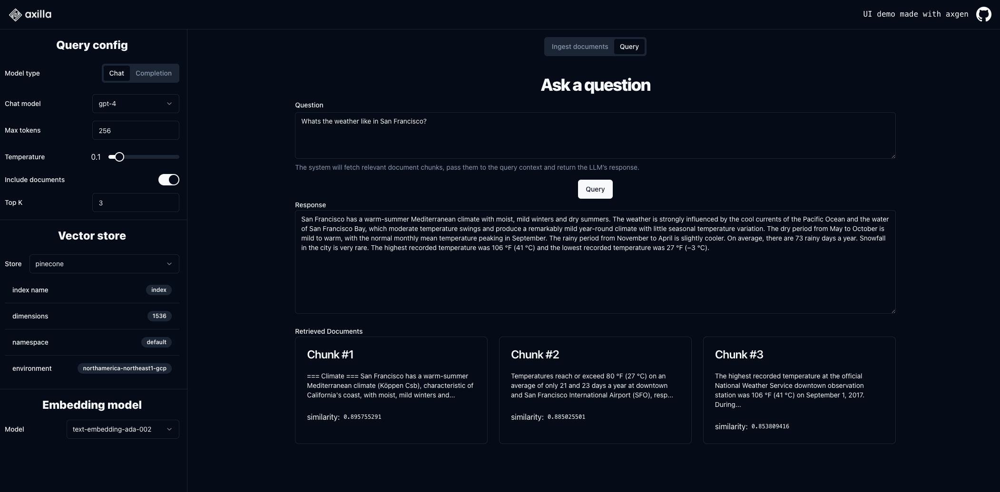

# Axilla demo UI

### [Demo video 🎥](https://www.loom.com/share/458f9b6679b740f0a5c78a33fffee3dc)

This demo UI showcases how to build RAG (retrieval augmented generation) workflows using the [axgen](https://github.com/axilla-io/axgen) library.

The UI covers the usual flow, which has 2 separate parts:

1.  Ingest documents into a vector store (this demo shows ingesting from files and from wikipedia, but you could plug any data source)
2.  Ask questions with augmented context for retrieval (by fetching chunks of the ingested documents to enrich the answer)

You can easily toggle document inclusion on/off, to see the difference. The UI also shows the documents that were retrieved which helps troubleshoot why the answer is what it is.

[Axgen](https://github.com/axilla-io/axgen) is fully configurable, as this UI demonstrates.

Please give us any feedback (bugs, requests, questions) at hello@axilla.io. We love talking to our users so don't be shy.

## Axilla

At [Axilla](https://axilla.io), we are building an opinionated end-to-end framework to work with LLMs in TypeScript.
Our first module open source module is [axgen](https://github.com/axilla-io/axgen), focused on document ingestion and retrieval. Giving it a star ⭐️ is very helpful for our visibility, so we appreciate it if you can spare one!

## Usage

This is a simple nextJS application, that was tested using node 18.

### Steps

1. Clone the repo: `git clone https://github.com/axilla-io/demo-ui.git`
2. Ensure you have the right environment variables setup: `cp .env.example .env`
3. Install packages: `npm i`
4. Run it: `npm run dev  # will run on localhost:3300`

## License

Licensed under the [MIT license](https://github.com/shadcn/ui/blob/main/LICENSE.md).
